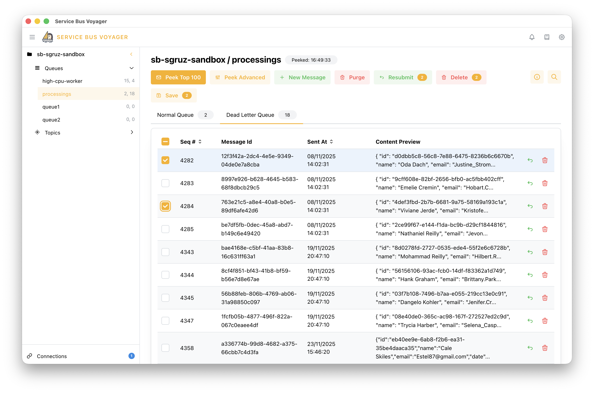

# Service Bus Voyager 

  

A lightweight, intuitive desktop application for exploring and managing Azure Service Bus. It provides a modern, responsive interface for developers working with Azure Service Bus queues, topics, and messages.

## ✨ Key Features

- **🎉 100% FREE FOREVER for individual developers and small companies!** — No hidden costs, no subscriptions, no paywalls. Always accessible to the developer community.
- **💻 Cross-platform** — Available for Windows, macOS, and Linux
- **🎨 Modern UI** — Built with React and Mantine UI for a sleek, user-friendly experience
- **🔐 Multiple Authentication Options** — Connection string, Entra ID (Interactive Browser), Entra ID (Device Code Flow)
- **📚 Multi-namespace Support** — Connect to multiple Service Bus namespaces simultaneously
- **🧰 Infrastructure Management** — Create, update, and delete queues, topics, and subscriptions
- **📨 Message Management** — Browse, view, delete, and purge messages with JSON/text preview support
- **🚀 Send Messages** — Create, import and send messages with custom properties and body content
- **🔍 Filter & Search** — Advanced filtering and searching capabilities for messages
- **♻️ Resubmission** — Resend messages to the same or different queues/topics
- **📊 Entity Overview** — Monitor queues and topics with real-time message counts and runtime properties

## 💾 Download

Get the latest release from [GitHub Releases](https://github.com/Kakaranish/ServiceBusVoyager-app/releases).

## 💰 Pricing

Service Bus Voyager is currently in **beta** and completely free for everyone. Once the application exits beta and becomes production-ready, pricing for medium and large companies will be introduced. 

**Individual developers and small companies will always have free access!**

